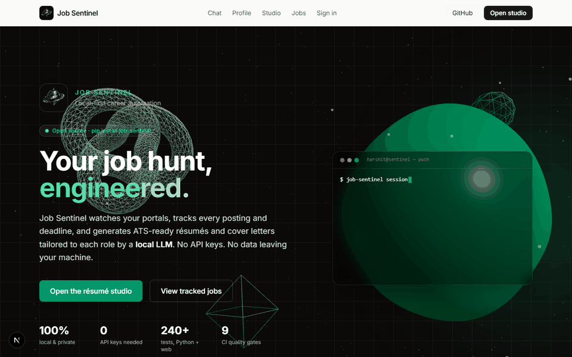
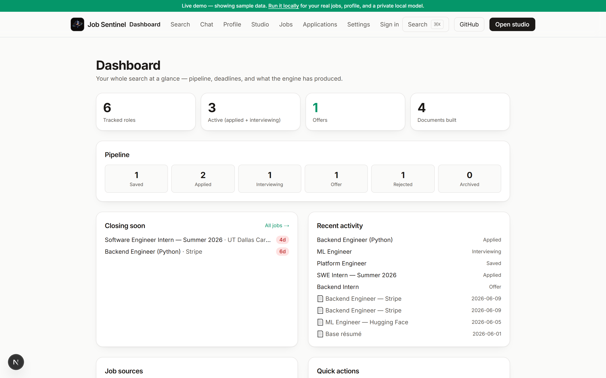
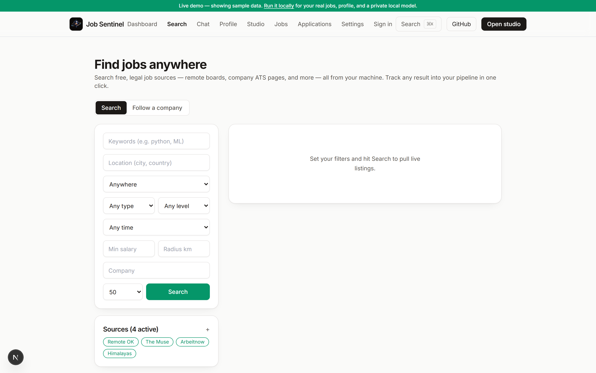
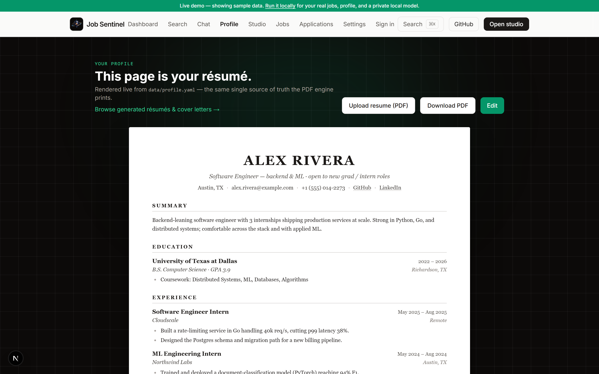
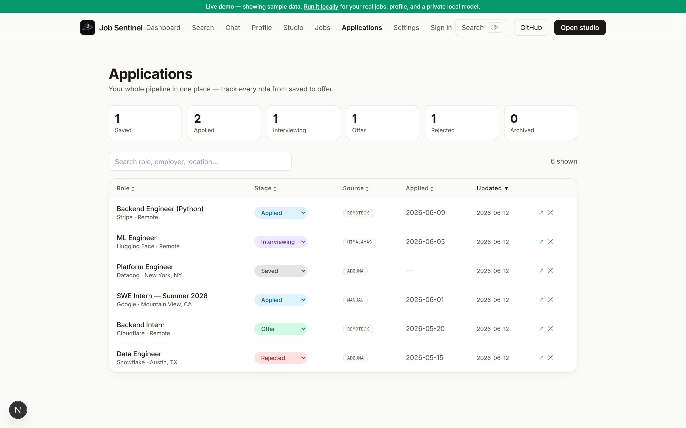
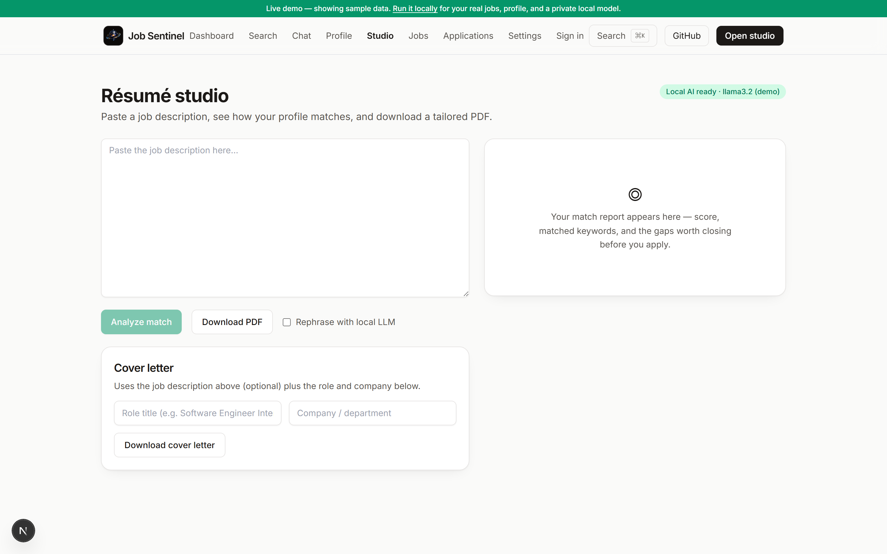
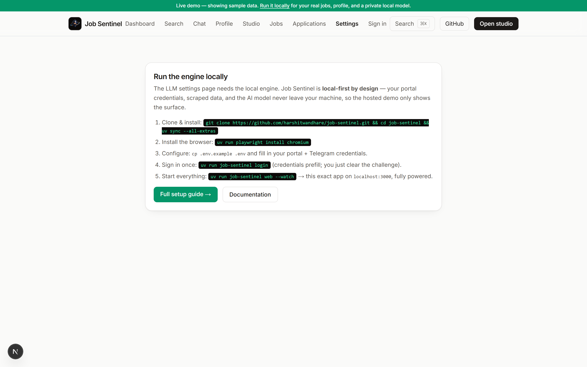
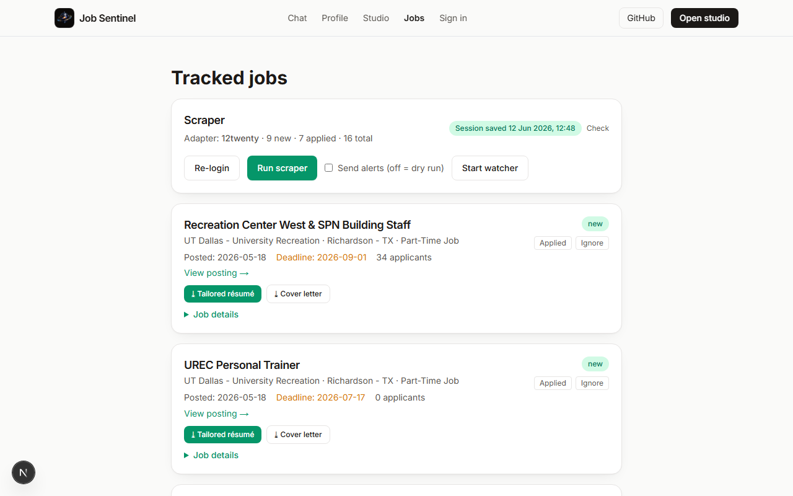
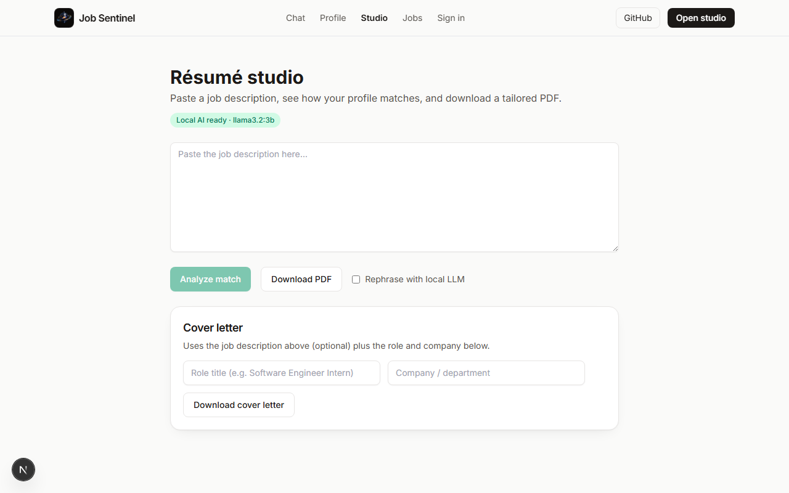

<p align="center">
  
</p>

# Job Sentinel

> **Local-first career platform: multi-source job search, AI profile↔job match, application tracker, and ATS-tuned résumé generation — all on your own hardware.**

[](https://github.com/harshitwandhare/job-sentinel/actions/workflows/ci.yml)
[](https://www.bestpractices.dev/projects/13183)
[](https://securityscorecards.dev/viewer/?uri=github.com/harshitwandhare/job-sentinel)
[](https://www.python.org/downloads/)
[](LICENSE)
[](https://github.com/astral-sh/ruff)
[](https://github.com/astral-sh/uv)
[](https://conventionalcommits.org)

<p align="center">
  <a href="https://job-sentinel.vercel.app"><b>🌐 Live demo</b></a> ·
  <a href="https://harshitwandhare.github.io/job-sentinel/"><b>📚 Docs</b></a> ·
  <a href="https://github.com/harshitwandhare/job-sentinel/releases"><b>📦 Releases</b></a>
</p>

<p align="center">
  
</p>

Job Sentinel watches your university job portals, aggregates listings from
public job APIs, tracks your applications, and generates **ATS-ready résumés
and cover letters tailored to each role** — entirely on your own machine. No
API keys required for the defaults, no data leaving your hardware.

It ships with adapters for **UTD 12twenty** and **Handshake**, four no-key job
sources (RemoteOK, The Muse, Arbeitnow, Himalayas), two opt-in keyed sources
(Adzuna, USAJobs), company-board fetchers (Greenhouse/Lever/Ashby), and a
multi-provider LLM layer you can point at Ollama, OpenRouter, Groq, Gemini, or
OpenAI. Adding a new portal adapter takes one file and ~50 lines of Python.

> **🌐 Hosted demo vs. running locally** — the
> [live demo](https://job-sentinel.vercel.app) shows the interface, but the
> engine (scraping, local AI, PDF builds) runs **on your machine by design**:
> your portal credentials, your data, and the model never leave it. Follow the
> [Quick Start](#-quick-start) below to run the real thing — about 5 minutes.

### ⚡ One-command setup

```bash
git clone https://github.com/harshitwandhare/job-sentinel && cd job-sentinel
bash scripts/install.sh        # macOS / Linux  (Windows: powershell -ExecutionPolicy Bypass -File scripts\install.ps1)
job-sentinel web               # API + web UI at http://localhost:3000
```

There's also a [**clip-to-track browser extension**](extension/) — one click on any
job posting (LinkedIn, Greenhouse, Lever, Indeed…) drops it straight into your tracker.

## 📸 What it looks like

|  |  |
|---|---|
| **Dashboard** — pipeline, deadlines, source health | **Find jobs anywhere** — multi-source search + filters |
| [](.github/assets/screens/dashboard.png) | [](.github/assets/screens/search.png) |
| **Your profile *is* your résumé** — rendered live, exports to ATS PDF | **Application tracker** — saved → applied → offer |
| [](.github/assets/screens/profile.png) | [](.github/assets/screens/applications.png) |
| **Résumé studio** — tailor + ATS score against any JD | **Settings** — bring your own LLM (or local Ollama) |
| [](.github/assets/screens/studio.png) | [](.github/assets/screens/settings.png) |

<sub>Screens shown with the bundled demo dataset. Run locally for your real jobs, profile, and a private model.</sub>

## 🧭 Why this exists

The 2026 job market is brutal for students: the average opening now draws
[~242 applications](https://huntr.co/research/job-search-trends-q1-2026) (3×
the 2021 volume), [93% of seekers have applied to a ghost
job](https://www.cpapracticeadvisor.com/2026/04/30/ghost-jobs-still-haunting-67-of-job-seekers-report-finds/182536/),
and [two-thirds have been rejected by an AI
screen](https://enhancv.com/blog/ai-hiring-statistics/) without a human ever
reading their résumé. The edge that's left: apply **early** (watch portals,
don't scroll them) and apply **matched** (ATS-clean documents tailored to each
posting).

Every mainstream tool that helps with this is cloud SaaS — your résumé, your
application history, and the jobs you're chasing live on someone else's
servers, behind a freemium meter. Job Sentinel is the same loop with the
opposite architecture:

| | Job Sentinel | Cloud trackers (Simplify/Teal/Huntr) | AI auto-apply bots | OSS resume builders |
|---|---|---|---|---|
| Open source | ✅ MIT | ❌ | partly | ✅ |
| Data stays on your machine | ✅ by design | ❌ | ❌ cloud LLM keys | ❌ usually |
| Portal monitoring + alerts | ✅ | ❌ | ❌ | ❌ |
| Multi-source job search | ✅ 7+ sources | ❌ or limited | ❌ | ❌ |
| Application tracker | ✅ full CRUD | ✅ cloud | ❌ | ❌ |
| AI profile↔job match | ✅ local + BYO | ✅ cloud | ✅ cloud | ❌ |
| Tailored ATS documents | ✅ local LLM | ✅ cloud | ✅ cloud | ✅ cloud |
| Account-ban risk | none — you apply | none | **high** (ToS) | none |
| Cost | $0 forever | freemium | API costs | $0 + API keys |

One integrated pipeline — **watch → alert → track → tailor → apply** — typed,
tested, and free, on hardware you already own.

<details>
<summary><b>Table of contents</b></summary>

- [Why this exists](#-why-this-exists)
- [Features](#-features)
- [Architecture](#-architecture)
- [Quick Start](#-quick-start)
- [Configuration](#%EF%B8%8F-configuration)
- [Bot Commands](#-bot-commands)
- [Résumé Generator](#-résumé-generator)
- [AI Providers](#optional-ai-providers-bring-your-own-key)
- [Web UI](#-web-ui)
- [Adding a New Portal](#-adding-a-new-portal)
- [Development](#-development)
- [Deployment & data persistence](#-deployment-always-on--data-persistence)
- [Project Structure](#-project-structure)
- [Roadmap](#-roadmap)
- [Contributing](#-contributing)

</details>

---

## ✨ Features

| Feature | Details |
|---|---|
| **Pluggable portal adapters** | One Python file per portal — no core changes needed |
| **Multi-source job search** | Aggregate across RemoteOK, The Muse, Arbeitnow, Himalayas (no key); Adzuna, USAJobs (opt-in keyed); JobSpy scraper; Greenhouse/Lever/Ashby company boards |
| **AI profile↔job match** | Blended ATS keyword + semantic embedding + optional LLM rationale; `POST /api/match` |
| **Application tracker** | Kanban-style pipeline (saved → applied → interviewing → offer/rejected); full CRUD via CLI, API, and web |
| **Document library** | Generated résumés and cover letters persisted with ATS scores; browse, download, or delete from the UI |
| **Dashboard** | At-a-glance funnel stats, recent activity, and quick-action cards |
| **Telegram bot** | Rich alerts + commands (`/jobs`, `/applied`, `/stats`, `/deadlines`, …) |
| **Résumé engine** | Universal profile → ATS-friendly LaTeX/PDF, tailored per posting |
| **BYO-LLM providers** | Ollama (local, default), OpenAI, OpenRouter, Groq, Gemini, or any custom OpenAI-compatible endpoint — swap per `.env` or the Settings page |
| **Web UI** | Next.js + Tailwind app: dashboard, job search, applications, résumé library, settings, profile editor, studio, jobs board, chat, ⌘K palette |
| **Hosted demo mode** | `NEXT_PUBLIC_DEMO=1` — every screen alive with realistic sample data; no backend needed |
| **One-command web app** | `job-sentinel web` starts FastAPI + Next.js together |
| **Local API** | FastAPI layer (`job-sentinel serve`) the UI consumes — one source of truth |
| **Email + Telegram alerts** | Two notifier channels; email is optional SMTP |
| **Deadline awareness** | `/deadlines` flags postings closing within a configurable window |
| **Status tracking** | NEW → SEEN → APPLIED / IGNORED / CLOSED, persisted in SQLite |
| **Closed detection** | Marks postings that disappear from the portal |
| **Resume PDF import** | Upload an existing resume → structured profile draft (local-LLM or heuristic) |
| **Session management** | `job-sentinel session` validity check; login prefills credentials from `.env` |
| **Per-job documents** | One-click tailored résumé + cover letter PDFs from any tracked posting |
| **Optional auth** | `AUTH_MODE=demo\|required`: PBKDF2 accounts, HMAC tokens, admin-managed invites |
| **Production-grade** | `mypy --strict`, 450+ tests (80% gate), ESLint+vitest, OpenSSF Scorecard, reproducible `uv.lock` builds, Docker |

---

## 🏗 Architecture

```
┌─────────────────────────────────────────────────────────────────────────┐
│                             Job Sentinel                                │
│                                                                         │
│  ┌──────────────┐   ┌───────────────┐   ┌──────────────────────────┐   │
│  │   Scheduler  │──▶│  SiteAdapter  │──▶│     JobRepository        │   │
│  │ (APScheduler)│   │  (Playwright) │   │  (sqlite-utils, SQLite)  │   │
│  └──────┬───────┘   └───────────────┘   │  job_postings            │   │
│         │                               │  applications            │   │
│         ▼                               │  generated_documents     │   │
│  ┌──────────────┐                       └──────────────────────────┘   │
│  │  Notifiers   │  ┌────────────────────────────────────────────────┐  │
│  │ Telegram/    │  │              FastAPI (local API)               │  │
│  │ Email        │  │  profile · jobs · match · applications ·       │  │
│  └──────────────┘  │  documents · sources · llm/config · ops        │  │
│                    └────────────────┬───────────────────────────────┘  │
│  ┌──────────────┐                   │                                  │
│  │ Job Sources  │                   ▼                                  │
│  │ (HTTP/JSON)  │   ┌──────────────────────────────────────────────┐  │
│  │ RemoteOK     │   │         Next.js Web UI (localhost:3000)      │  │
│  │ The Muse     │   │  dashboard · search · applications · resumes │  │
│  │ Arbeitnow    │   │  settings · jobs · profile · studio · chat   │  │
│  │ Himalayas    │   └──────────────────────────────────────────────┘  │
│  │ Adzuna …     │                                                      │
│  └──────────────┘   ┌──────────────────────────────────────────────┐  │
│                     │     LLM Provider Layer (documents/providers)  │  │
│  ┌──────────────┐   │  OllamaBackend · OpenAICompatClient           │  │
│  │ Company ATS  │   │  (OpenAI / OpenRouter / Groq / Gemini /      │  │
│  │ Greenhouse   │   │   custom) · build_chat_backend/embed_backend  │  │
│  │ Lever · Ashby│   └──────────────────────────────────────────────┘  │
│  └──────────────┘                                                      │
└─────────────────────────────────────────────────────────────────────────┘
```

See [docs/design/HLD.md](docs/design/HLD.md) for the full High-Level Design
and [docs/design/LLD.md](docs/design/LLD.md) for Low-Level Design.

---

## 🚀 Quick Start

### 1. Prerequisites

- Python 3.11+
- [uv](https://docs.astral.sh/uv/) (install: `curl -LsSf https://astral.sh/uv/install.sh | sh`)
- A Telegram account

### 2. Clone & Install

```bash
git clone https://github.com/harshitwandhare/job-sentinel.git
cd job-sentinel

# Install all dependencies (creates .venv automatically)
uv sync

# Install Playwright's Chromium browser
uv run playwright install chromium
```

### 3. Create your Telegram bot

1. Open Telegram and message **[@BotFather](https://t.me/BotFather)**
2. Send `/newbot` and follow the prompts → copy the **token**
3. Message your new bot once, then visit:
   `https://api.telegram.org/bot<TOKEN>/getUpdates`
4. Copy your **chat ID** from the JSON response (`message.chat.id`)

### 4. Configure

```bash
cp .env.example .env
# Edit .env and fill in:
#   TELEGRAM_BOT_TOKEN=...
#   TELEGRAM_CHAT_ID=...
#   PORTAL_USERNAME=your_utd_netid
#   PORTAL_PASSWORD=your_password
```

### 5. Sign in once (Cloudflare-gated portals)

```bash
uv run job-sentinel login     # a browser opens; credentials prefill from .env —
                              # clear the challenge, click Sign In, done
uv run job-sentinel session   # verify: "✓ Session valid as <your name>"
```

> ⚠️ Don't add a `viewId=<n>` parameter to `PORTAL_JOBS_URL` — saved-search
> views can be "not authorized" for your account, which silently renders an
> empty list (the classic "scrape found 0 jobs" trap).

### 6. Test run (dry run — no messages sent)

```bash
uv run job-sentinel scrape
```

### 7. Start the full bot

```bash
uv run job-sentinel run
```

That's it. Open Telegram and send `/start` to your bot.

---

## ⚙️ Configuration

All configuration is via environment variables in `.env`.
See [`.env.example`](.env.example) for the full reference.

| Variable | Default | Description |
|---|---|---|
| `TELEGRAM_BOT_TOKEN` | — | **Required.** From @BotFather |
| `TELEGRAM_CHAT_ID` | — | **Required.** Your Telegram user/chat ID |
| `PORTAL_USERNAME` | — | **Required.** Portal login |
| `PORTAL_PASSWORD` | — | **Required.** Portal password |
| `PORTAL_JOBS_URL` | UTD 12twenty URL | Full URL to the listings page |
| `SITE_ADAPTER` | `12twenty` | Adapter to use |
| `POLL_INTERVAL_SECONDS` | `900` | Scrape interval (min: 60) |
| `KEYWORD_FILTERS` | _(empty = all)_ | CSV: `software,engineer,research` |
| `HEADLESS` | `true` | Run browser headless |
| `DRY_RUN` | `false` | Scrape but don't send alerts |
| `OLLAMA_MODEL` | `llama3.2:3b` | Local model for AI features (3B fits 4 GB GPUs) |
| `AUTH_MODE` | `off` | `off` / `demo` (gate writes) / `required` (gate all) |
| `LOG_LEVEL` | `INFO` | `DEBUG`/`INFO`/`WARNING`/`ERROR` |

---

## 🤖 Bot Commands

| Command | Description |
|---|---|
| `/jobs` | Trigger a fresh scrape + show recent postings |
| `/recent` | Show last 10 jobs from the database |
| `/applied <id>` | Mark posting as applied |
| `/ignore <id>` | Dismiss a posting |
| `/status <id>` | Full details of a specific posting |
| `/stats` | Counts by status (new / seen / applied / ignored / closed) |
| `/deadlines` | Postings closing within `DEADLINE_ALERT_DAYS` |
| `/filters` | Show active keyword filters |
| `/adapters` | List available site adapters |
| `/ping` | Health check |

---

## 📄 Résumé Generator

Job Sentinel keeps a **universal profile** — your master CV data in one
hand-editable YAML file — and renders ATS-friendly PDFs from it. It's
standalone: you don't need the Telegram bot configured to use it.

```bash
# 1. Scaffold a profile you can edit like an Overleaf source
uv run job-sentinel resume init        # writes data/profile.yaml

# 2. Edit data/profile.yaml — add education, experience, projects, skills…

# 3. Build an ATS-friendly PDF (also writes the .tex next to it)
uv run job-sentinel resume build -o data/resume.pdf
uv run job-sentinel resume show        # summarise your profile

# 4. Tailor to a specific posting — reorders content by relevance and
#    reports ATS keyword coverage (matched vs missing terms)
uv run job-sentinel resume build --job-text "paste a job description here"
uv run job-sentinel resume build --job-id <posting_id>   # a posting already scraped

# 5. Generate a tailored cover letter (deterministic, or --ai to polish locally)
uv run job-sentinel resume cover --job-text "…" --role "Student Assistant" --company "UTD"
```

PDF rendering uses **[Tectonic](https://tectonic-typesetting.github.io)** (a
self-contained LaTeX engine — no full TeX install needed). Install it once:

```bash
winget install TectonicProject.Tectonic   # Windows
brew install tectonic                      # macOS
cargo install tectonic                     # Linux (or your package manager)
```

If Tectonic isn't installed, `resume build` still writes the `.tex` so you can
compile it on Overleaf. The template is single-column with standard fonts and
real selectable text, so it parses cleanly through ATS.

### Optional: local-LLM rephrasing (no API key)

Add `--ai` to rephrase your bullets toward a posting using a **local** model via
[Ollama](https://ollama.com) — fully offline, no API key, your data never leaves
your machine. It only *rephrases* content already in your profile (it can't
invent facts), and falls back to keyword tailoring if the model isn't available.

```bash
job-sentinel resume doctor --pull      # checks Ollama + pulls the model
job-sentinel resume build --ai --job-text "paste a job description"
```

### AI providers (bring your own key)

Ollama is the zero-config default — no account, no key, fully offline. You can
swap either the chat model or the embeddings model for any cloud provider
(OpenRouter, Groq, Gemini, OpenAI) via the **Settings** page at
`http://localhost:3000/settings` or by setting env vars in `.env`.
Free tiers exist for OpenRouter, Groq, and Gemini. Groq is fast but does not
support embeddings — pair it with Gemini or Ollama for that slot.

See [docs/llm-providers.md](docs/llm-providers.md) for the full reference:
env var names, per-provider setup, graceful-degradation behaviour, and the
privacy/security posture.

---

## 🖥 Web UI

Prefer a UI? Job Sentinel ships a local web app (Next.js + Tailwind) over a
FastAPI layer — same engine, nicer surface. It's fully local: the API binds to
localhost and the optional LLM stays on your machine.

```bash
# One command for everything: API + UI + recurring scrape watcher
uv run job-sentinel web --watch        # http://localhost:3000

# Or piecemeal:
job-sentinel serve                     # API only — Swagger at /docs
cd web && npm install && npm run dev   # UI only
```

| Page | URL | What it does |
|---|---|---|
| Landing | `/` | Animated intro with a self-typing terminal session replay |
| Dashboard | `/dashboard` | Funnel stats, recent applications, and quick-action cards |
| Job Search | `/search` | Keyword search across enabled job sources; track results with one click |
| Applications | `/applications` | Kanban-style application pipeline (saved → offer/rejected) |
| Résumé Library | `/resumes` | Browse, download, and delete generated résumés and cover letters |
| Settings | `/settings` | BYO-LLM provider config + job-source management; live test buttons |
| Profile | `/profile` | View and edit your universal profile (education, experience, projects…) |
| Profile Edit | `/profile/edit` | Full section editor + résumé-PDF import |
| Jobs Board | `/jobs` | Tracked portal postings; per-posting résumé/cover-letter generation |
| Résumé Studio | `/studio` | Paste a JD → live ATS coverage + AI match → tailored PDF |
| Chat | `/chat` | Sentinel assistant: answers from your real data, local LLM for the rest |
| Login | `/login` | Auth gate (when `AUTH_MODE=demo\|required`) |

The **⌘K command palette** (`CommandPalette`) is always available for fast
navigation. **Hosted-demo mode** (`NEXT_PUBLIC_DEMO=1`) populates every screen
with realistic sample data so visitors can explore without a running backend.

| Jobs board — real scraped postings, one-click tailored documents | Résumé studio — paste a JD, get ATS coverage + a one-page PDF |
|---|---|
|  |  |

### Sharing your instance (optional auth)

Want a public demo of *your* instance, or to invite a friend? Turn on
authentication — stdlib-only, no services:

```bash
job-sentinel users add yourname --admin   # first account must be an admin
AUTH_MODE=demo job-sentinel serve          # reads public, actions need login
```

`AUTH_MODE=demo` keeps browsing open but gates actions; `required` gates
everything. Admins create further accounts (`users add`, or `POST
/api/auth/users`). Details in [docs/deployment.md](docs/deployment.md).

---

## 🔌 Adding a New Portal

1. Create `src/job_sentinel/adapters/sites/my_portal.py`
2. Subclass `SiteAdapter`, implement `login()` and `scrape_page()`
3. Set `SITE_ADAPTER=my_portal` in your `.env`

Full guide: [docs/design/adapter-authoring.md](docs/design/adapter-authoring.md)

---

## 🛠 Development

```bash
# Install dev dependencies
uv sync --all-extras

# Install pre-commit hooks (runs ruff, mypy, secret scan on every commit)
uv run pre-commit install

# Run tests
uv run pytest

# Lint & format
uv run ruff check --fix .
uv run ruff format .

# Type check
uv run mypy src/

# All at once (same as CI)
uv run pre-commit run --all-files
```

---

## 🐳 Deployment (always-on) & data persistence

Run it continuously with Docker — the image is based on the official Playwright
image (Chromium + system libs included):

```bash
docker compose up -d --build     # start detached
docker compose logs -f           # follow
```

**Your data never vanishes on restart.** `./data` and `./logs` are bind-mounted
from the host, so the SQLite database, captured login session, and your profile
live on disk — surviving container restarts, rebuilds, and reboots.

> 12twenty's login is Cloudflare-gated, so capture a session on the host first
> with `job-sentinel login` (it writes `data/session.json`, which the container
> mounts and reuses). Re-run `login` if the session expires.

**Backups.** Everything important is in `data/`. Back it up while the bot is
idle — e.g. a WAL-safe SQLite copy:

```bash
sqlite3 data/jobs.db ".backup data/jobs.backup.db"
cp data/profile.yaml data/profile.backup.yaml
```

---

## 📁 Project Structure

```
job-sentinel/
├── src/job_sentinel/
│   ├── adapters/              # Plugin system: base interface, registry,
│   │   └── sites/             #   12twenty + Handshake adapters
│   ├── api/                   # FastAPI layer: routes, ops runner, auth, chat
│   ├── bot/                   # Telegram command handlers
│   ├── config/                # pydantic-settings config + loguru setup
│   ├── core/                  # Browser, models (JobPosting/Application/
│   │                          #   GeneratedDocument), scheduler, session, text
│   ├── db/                    # sqlite-utils repository (schema v2)
│   ├── documents/             # Resume engine: LaTeX, tailoring, LLM,
│   │                          #   embeddings, cover letters, PDF import,
│   │                          #   providers (ChatBackend/EmbedBackend), match
│   ├── notifiers/             # Telegram (MarkdownV2) + SMTP email
│   ├── profile/               # Universal profile models + YAML store
│   ├── sources/               # Pluggable job-source layer: JobSource ABC,
│   │                          #   registry, aggregate_search; RemoteOK / The Muse /
│   │                          #   Arbeitnow / Himalayas / Adzuna / USAJobs / JobSpy;
│   │                          #   company_boards (Greenhouse/Lever/Ashby)
│   └── __main__.py            # Typer CLI entry-point
├── web/                       # Next.js UI (App Router, Tailwind, vitest)
│   ├── app/                   # page.tsx per route (landing, dashboard, search,
│   │                          #   applications, resumes, settings, jobs, profile,
│   │                          #   studio, chat, login)
│   ├── components/            # AiMatch, DataTable, SearchResultCard, JobsExplorer,
│   │                          #   ResumePaper, CommandPalette, Nav, ScraperControls…
│   └── lib/                   # api.ts (typed client), demo.ts (NEXT_PUBLIC_DEMO)
├── tests/                     # unit/ · integration/ · e2e/ (450+ tests)
├── docs/                      # MkDocs site: HLD, LLD, ADRs, llm-providers,
│                              #   compliance, deployment, NORTH_STAR
├── .github/workflows/         # CI · Release · Docs · Scorecard
├── pyproject.toml             # Single source of truth (uv + hatchling)
└── uv.lock                    # Reproducible builds (CI uses --locked)
```

---

## 📋 Roadmap

- [x] Résumé engine (universal profile → ATS LaTeX/PDF) with per-posting tailoring
- [x] Local-LLM rephrasing via Ollama (no API key)
- [x] Web UI (Next.js) + local FastAPI layer — full CLI feature parity
- [x] Email notifier (optional SMTP) alongside Telegram
- [x] Deadline-aware tracking (`/deadlines`)
- [x] Docker / docker-compose with persistent data
- [x] Cover-letter generation (deterministic + local-LLM polish)
- [x] Semantic relevance ranking (local embeddings via Ollama)
- [x] Resume PDF import → structured profile draft
- [x] Session validity checks + credential-prefilled login
- [x] Optional multi-user auth (demo/required modes, admin invites)
- [x] Hosted demo (Vercel) + docs site (GitHub Pages) — both $0
- [x] Multi-source job search — RemoteOK, The Muse, Arbeitnow, Himalayas, Adzuna, USAJobs, JobSpy; Greenhouse/Lever/Ashby company boards (see [ADR 005](docs/adr/005-job-source-layer.md))
- [x] BYO-LLM providers — OpenAI, OpenRouter, Groq, Gemini alongside Ollama; configurable from Settings UI (see [docs/llm-providers.md](docs/llm-providers.md))
- [x] AI profile↔job match — blended ATS + semantic + grounded LLM rationale (`POST /api/match`)
- [x] Application tracker — full CRUD pipeline (saved → interviewing → offer/rejected), CLI + API + web
- [x] Document library — persisted generated résumés and cover letters with ATS scores
- [x] Dashboard — funnel stats, recent activity, quick actions
- [x] ⌘K command palette
- [ ] Deeper ATS scoring — parser-style simulation of the big enterprise ATSes,
      beyond keyword coverage
- [ ] Ghost-job signals — flag stale/repost patterns before you sink hours in
- [ ] Application analytics — funnel stats over your own history (response
      rates by employer, day-of-week, match score)
- [ ] Discord webhook notifier
- [ ] Playwright e2e suite against `job-sentinel web`
- [ ] Packaged installers + PyPI publish

---

## 🤝 Contributing

Contributions are welcome! Please read [CONTRIBUTING.md](CONTRIBUTING.md) first.

All commits must follow [Conventional Commits](https://conventionalcommits.org).
Run `uv run pre-commit install` to enforce this automatically.

---

## 👤 Author

Built and maintained by **Harshit Wandhare** — a CS student who got tired of the
2026 job grind and decided to engineer a way through it. If this project is
useful, a ⭐ helps; if you're hiring, I'd love to talk.

- GitHub — [@harshitwandhare](https://github.com/harshitwandhare)
- LinkedIn — [in/harshit-wandhare](https://www.linkedin.com/in/harshit-wandhare-a088201aa/)

---

## 📄 License

MIT © [Harshit Wandhare](https://github.com/harshitwandhare) — see [LICENSE](LICENSE).
